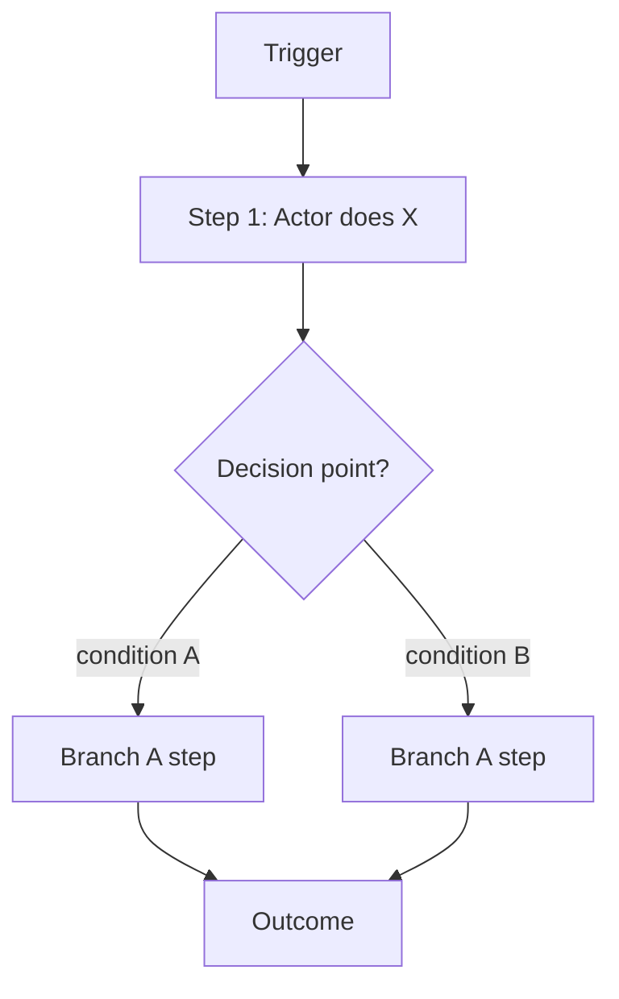

## First-use setup (Claude: complete this, then delete this entire section)

This skill has not yet been adapted to this company. Before running it the first time:
1. Read company/overview.md and any other company/ files relevant to this skill (if empty, ask the user to run /onboard first).
2. Ask the user:
   - What tools/systems should this skill assume by default when mapping a workflow (CRM, helpdesk, project management tool, etc.)? → fills `{{COMPANY_TOOLS}}`
   - What roles or departments most often show up as actors in this company's workflows (for default swimlanes)? → fills `{{DEFAULT_ACTORS}}`
   - Where should generated workflow docs live? Default is `workflows/<slug>/`. → fills `{{WORKFLOW_OUTPUT_LOCATION}}`
3. Edit THIS file (`.claude/skills/workflow-mapper/SKILL.md`): replace every `{{PLACEHOLDER}}` with the real answers, adjust defaults to fit this company, then DELETE this entire "First-use setup" section.
4. Confirm to the user what was adapted, then proceed with their original request.

The presence of this section means the skill is uninitialized; its absence means initialized.

---

## What this skill does

Breaks any workflow down into a structured process doc with an embedded flowchart, in one markdown file. Accepts three input modes: interactive Q&A, transcript/text dump, or an image/screenshot.

## Step 1: Pick an input mode

Present these three options via AskUserQuestion (skip only if the input mode is already obvious — the user pasted a transcript, attached an image, or said "ask me questions"):

1. **Interactive Q&A** — discovery questions, built from the answers
2. **Transcript / text dump** — a meeting transcript, SOP, or written description
3. **Image / screenshot** — a whiteboard photo, existing diagram, or flowchart screenshot

## Step 2: Elicit the workflow

### Mode A: Interactive Q&A

Ask one round at a time via AskUserQuestion — don't batch everything into one giant form. Cover at minimum:

1. **Trigger & goal** — what kicks it off, what's the end state?
2. **Actors & systems** — who's involved (people, roles, systems)? Suggest `{{DEFAULT_ACTORS}}` and `{{COMPANY_TOOLS}}` as likely candidates, but confirm rather than assume.
3. **Happy path steps** — the main sequence, one step at a time: who does it, what input, what output.
4. **Decisions & branches** — where does the flow split, and on what condition?
5. **Exceptions** — what can go wrong, and what's the fallback?
6. **Outputs & handoffs** — what's produced, and where does it go?

Stop as soon as there's enough to draw a coherent diagram, or immediately if the user says "that's enough." Never invent a step — ask rather than guess.

### Mode B: Transcript / text dump

Read it carefully. Extract trigger, actors, steps, decisions, inputs/outputs, exceptions. Ask targeted follow-up questions only for genuine gaps — don't fill them in with assumptions.

### Mode C: Image / screenshot

Read the image, then **transcribe first**: a plain-text outline of what's shown (boxes, arrows, labels, swimlanes) with no interpretation. Show the transcription and ask "Is this what the diagram shows — anything I missed?" Only structure it into the process spec after confirmation.

## Step 3: Draft the process doc

Show this inline first — do not write to disk yet:

```markdown
# Workflow: [Title]

**Trigger:** [what starts it]
**Goal:** [end state]
**Actors:** [people, roles, systems]

## Happy Path
1. **[Actor]** — [action] → [output]

## Decisions
- **[Decision point]:** [condition] → [branch A] / [branch B]

## Exceptions
- **[Scenario]:** [what happens]

## Inputs & Outputs
- **Inputs:** [list]
- **Outputs:** [list]
```

## Step 4: Confirm before writing files

Ask explicitly: **"Does this match the workflow? Should I turn it into the diagram?"** Do not write anything until the user confirms. Revise and re-confirm if they request changes.

## Step 5: Write the file

Once approved:
1. Slugify the title (lowercase, hyphens) unless a slug was already given.
2. Create `{{WORKFLOW_OUTPUT_LOCATION}}` for this workflow (default: `workflows/<slug>/`).
3. Write `process.md` containing the confirmed spec from Step 3, **plus** a Mermaid flowchart built from the same steps directly beneath it, in the same file:

````markdown

````

   Use `flowchart LR` instead of `TD` when there are multiple actors and swimlanes read better left-to-right; group each actor's steps in a `subgraph "[Actor]"` block. Use diamond nodes (`{...}`) only for decision points, and label every branch arrow with its condition. Mermaid renders natively in GitHub and most markdown viewers — no extra tool or file format needed.
4. Confirm the file exists and report its path back to the user.

## Step 6: Handle iteration

- **Content changes** (new step, reworded label, different branch) — update the spec section first, then regenerate the Mermaid block to match.
- **Visual-only changes** (direction, grouping, spacing) — edit the Mermaid block directly; the spec section doesn't need to change.

## Guardrails

- **Never invent steps.** Ambiguous or incomplete input means asking, not guessing — a wrong diagram just has to be redrawn anyway.
- **Always confirm the outline before writing.** The spec is the source of truth for the diagram.
- **Image mode: transcribe → confirm → draw.** Never jump straight from image to diagram.
- **Cap complexity.** Past roughly 25 nodes, warn the user and suggest splitting into a master diagram plus linked sub-workflow docs.

## Output location

Default: `{{WORKFLOW_OUTPUT_LOCATION}}` — one `process.md` per workflow, containing both the structured doc and its embedded diagram. Honor a different path if the user specifies one.
